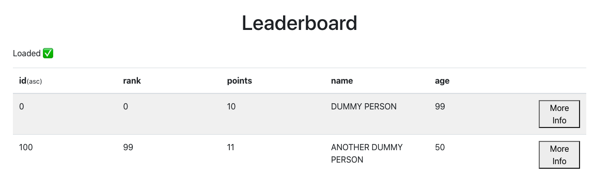
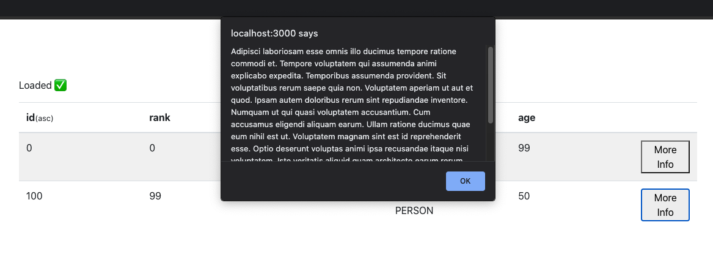

## RED FrontEnd Exercise

The goal of this exercise is to create a table of sortable data by building out all of the client side functionality and making the necessary connections between the server app and the client app. See the [README](client/README.md) for the complete list of client "to do's". 

Data records are expected to be fetched from the server app and displayed in the client app. See the [README](server/README.md) for details on the server app implementation to better understand how to communicate with it.

Here is an example, using demo data, of what we are aiming for with this excercise. Note that any design can be provided, we just used default `table` tags for the example screenshot.

We also ask for the table to include some fields to order by PLUS a "More Info" button that will display the description of a record within a custom made pop-up.
Here is a raw example using windows.alert:

